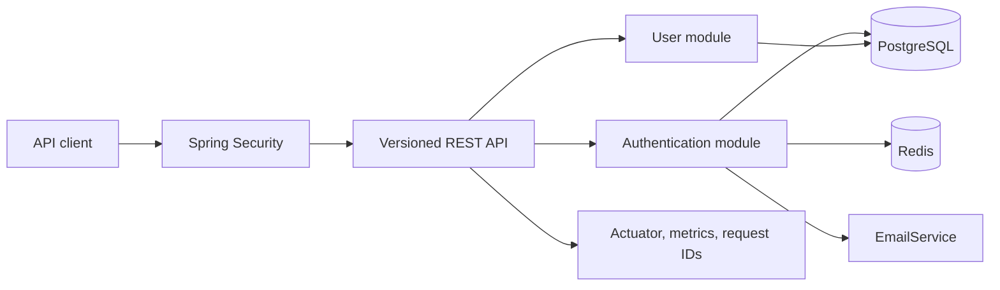

# Spring Backend Kit

[](https://github.com/kidus-kumato/spring-backend-kit/actions/workflows/ci.yml)


[](LICENSE)

**A production-oriented foundation for secure REST APIs with Java 21 and Spring Boot.**

Spring Backend Kit provides the infrastructure that most backend projects need before business development can begin: authentication, authorization, PostgreSQL persistence, Flyway migrations, Redis-backed rate limiting, audit logging, consistent errors, observability, API documentation, containers, and continuous integration.

> Clone it, configure the environment, run Docker Compose, and start building business modules instead of rebuilding backend infrastructure.

[Features](#features) · [Quick start](#quick-start) · [API reference](#api-reference) · [Postman](#test-the-api-with-postman) · [Architecture](#architecture) · [Security](#security-model) · [Configuration](#configuration)

---

## Features

| Area | Included capability |
|---|---|
| **Runtime** | Java 21, Spring Boot 3.5, Maven Wrapper |
| **Authentication** | Registration, email verification, login, JWT access tokens, rotating refresh tokens, logout |
| **Account recovery** | Generic forgot-password response and single-use password-reset tokens |
| **Authorization** | Role-based access control with `USER`, `ADMIN`, `MODERATOR`, and `SUPPORT` roles |
| **User management** | Read, update, and deactivate the current profile; paginated admin user listing |
| **Persistence** | PostgreSQL, Spring Data JPA, Hibernate validation, and versioned Flyway migrations |
| **Abuse protection** | Redis-backed IP rate limiting and temporary account lockout |
| **Security** | BCrypt password hashing, hashed server-side tokens, stateless Spring Security, configurable CORS |
| **Operations** | Actuator health, Prometheus metrics, request IDs, audit records, and correlated logs |
| **Developer experience** | Swagger UI, generated OpenAPI, Postman collection, Docker Compose, and GitHub Actions CI |
| **Testing** | JUnit 5, Spring Security test support, Mockito-ready Spring tests, and Testcontainers dependencies |

## Architecture

The project is an intentionally focused **modular monolith**. Each domain has a clear package boundary while the application remains simple to run, test, and deploy as one service.



The main modules are:

```text
src/main/java/com/example/backendkit/
├── auth/       Authentication, token lifecycle, email flows, and rate limiting
├── user/       User model, profile API, roles, statuses, and admin listing
├── security/   Stateless security configuration and JWT authentication filter
├── audit/      Security-relevant event persistence
└── common/     Error handling and request correlation
```

See [`architecture.md`](architecture.md) for the rationale behind the service boundaries and security decisions.

## Quick start

### Prerequisites

Install **Docker** with the Compose plugin. Git is required if you are cloning the repository.

### 1. Clone and configure

```bash
git clone https://github.com/kidus-kumato/spring-backend-kit.git
cd spring-backend-kit
cp .env.example .env
```

On Windows PowerShell, use `Copy-Item .env.example .env` instead of `cp`.

Open `.env` and replace `JWT_SECRET` with a strong random value containing at least 32 characters. Do not commit this file.

### 2. Start the stack

```bash
docker compose up --build
```

Docker Compose starts the API, PostgreSQL, and Redis. Once startup completes, verify the service:

```bash
curl http://localhost:8080/actuator/health
```

Expected response:

```json
{
  "status": "UP"
}
```

### 3. Explore the API

| Resource | Local URL | Access |
|---|---|---|
| API base | `http://localhost:8080` | — |
| Swagger UI | [`http://localhost:8080/swagger-ui.html`](http://localhost:8080/swagger-ui.html) | Public |
| OpenAPI JSON | [`http://localhost:8080/v3/api-docs`](http://localhost:8080/v3/api-docs) | Public |
| Health | [`http://localhost:8080/actuator/health`](http://localhost:8080/actuator/health) | Public |
| Prometheus metrics | `http://localhost:8080/actuator/prometheus` | Bearer token |

The OpenAPI document is generated at runtime from Spring configuration, controllers, validation constraints, and OpenAPI annotations.[1]

## Authentication walkthrough

Register an account:

```bash
curl --request POST http://localhost:8080/api/v1/auth/register \
  --header "Content-Type: application/json" \
  --data '{
    "email": "john@example.com",
    "password": "StrongPassword123!"
  }'
```

Local development uses `ConsoleEmailService`. It writes verification and password-reset tokens to the application logs instead of sending email. Read the latest token with:

```bash
docker compose logs spring-backend
```

Verify the email address:

```bash
curl --request POST http://localhost:8080/api/v1/auth/verify-email \
  --header "Content-Type: application/json" \
  --data '{"token":"PASTE_VERIFICATION_TOKEN"}'
```

Log in:

```bash
curl --request POST http://localhost:8080/api/v1/auth/login \
  --header "Content-Type: application/json" \
  --data '{
    "email": "john@example.com",
    "password": "StrongPassword123!"
  }'
```

A successful login returns an access token and a rotating refresh token:

```json
{
  "accessToken": "eyJ...",
  "refreshToken": "opaque-random-token",
  "tokenType": "Bearer",
  "expiresIn": 900
}
```

Use the access token on protected routes:

```bash
curl http://localhost:8080/api/v1/users/me \
  --header "Authorization: Bearer ACCESS_TOKEN"
```

## API reference

All application endpoints are versioned under `/api/v1`.

### Authentication

| Method | Endpoint | Access | Purpose |
|---|---|---|---|
| `POST` | `/api/v1/auth/register` | Public | Register a pending account and issue a verification token |
| `POST` | `/api/v1/auth/verify-email` | Public | Activate an account with a single-use token |
| `POST` | `/api/v1/auth/resend-verification` | Public | Issue a new verification token when required |
| `POST` | `/api/v1/auth/login` | Public | Authenticate an active account and issue a token pair |
| `POST` | `/api/v1/auth/refresh` | Public | Rotate a refresh token and issue a new token pair |
| `POST` | `/api/v1/auth/logout` | Public | Revoke the supplied refresh token |
| `POST` | `/api/v1/auth/forgot-password` | Public | Request a password-reset token using a generic response |
| `POST` | `/api/v1/auth/reset-password` | Public | Consume a reset token, change the password, and revoke refresh sessions |

### Users and administration

| Method | Endpoint | Access | Purpose |
|---|---|---|---|
| `GET` | `/api/v1/users/me` | Authenticated | Return the current user's safe profile |
| `PUT` | `/api/v1/users/me` | Authenticated | Update the current user's first and last name |
| `DELETE` | `/api/v1/users/me` | Authenticated | Deactivate the current account |
| `GET` | `/api/v1/admin/users` | `ADMIN` | Return a paginated and sorted user list |

The admin listing supports `page`, `size`, and `sort` query parameters. Page size must be between `1` and `100`. Allowed sort properties are `createdAt`, `email`, and `status`.

## Test the API with Postman

The repository includes [`Spring_Backend_Kit.postman_collection.json`](Spring_Backend_Kit.postman_collection.json), an import-ready Postman Collection v2.1 file. Postman can import the JSON directly through **Import**, by file selection, or by drag and drop.[2]

The collection contains **20 requests** organized by workflow. It generates a unique test email, captures access and refresh tokens after login, tests refresh-token rotation, checks role-based access, validates the error envelope, and includes platform health and metrics requests.

Recommended order:

1. Start the application with Docker Compose.
2. Import the collection into Postman.
3. Run **Register User**.
4. Copy the verification token from `docker compose logs spring-backend` into the collection variable `verificationToken`.
5. Run **Verify Email**, then **Login**.
6. Run profile, token-lifecycle, validation, and observability requests as needed.

Password recovery has the same manual development step: copy the logged reset token into the collection variable `resetToken` before sending **Reset Password**.

## Consistent error responses

Validation, authentication, authorization, domain, and unexpected failures use one response shape. Stack traces and sensitive values are not returned to clients.

```json
{
  "timestamp": "2026-09-15T12:00:00Z",
  "status": 400,
  "code": "VALIDATION_ERROR",
  "message": "Request validation failed",
  "path": "/api/v1/auth/register",
  "traceId": "1a6d6d0f-687d-45a0-9f2d-91aa05b0c213",
  "errors": [
    {
      "field": "email",
      "message": "must be a well-formed email address"
    }
  ]
}
```

Clients may send `X-Request-Id`; otherwise, the API generates one. The value is returned in the response header and included in error payloads.

## Security model

The reference implementation uses the following defaults:

| Control | Behavior |
|---|---|
| Password storage | BCrypt with strength `12` |
| Access token | Signed JWT, valid for `900` seconds by default |
| Refresh token | Opaque random token, SHA-256 hash stored, valid for `30` days, rotated on use |
| Email verification | Hashed single-use token, valid for `24` hours |
| Password reset | Hashed single-use token, valid for `30` minutes |
| Authentication rate limit | Five requests per IP per minute on sensitive flows |
| Account lockout | Five failed logins trigger a temporary `15`-minute lock |
| Authorization | Stateless bearer authentication with method-level role checks |
| Account deletion | Soft deletion by changing the account status to `INACTIVE` |

Redis rate limiting currently **fails open** when Redis is unavailable so an infrastructure outage does not block authentication. Decide whether production deployments should instead fail closed based on the system's availability and threat requirements.

### Production checklist

Before using the kit in production, use HTTPS, replace the development JWT secret, restrict CORS to trusted origins, and store secrets outside the repository. Replace `ConsoleEmailService` with a real provider, decide on a fail-open or fail-closed rate-limit policy, protect operational endpoints at the network layer, and add integration tests for your deployment environment.

## Configuration

Configuration is supplied through environment variables. Docker Compose reads them from `.env`.

| Variable | Default | Description |
|---|---|---|
| `APP_NAME` | `spring-backend-kit` | Spring application name |
| `DB_HOST` | `localhost` | PostgreSQL host; Compose overrides this to `postgres` |
| `DB_PORT` | `5432` | PostgreSQL port |
| `DB_NAME` | `backendkit` | PostgreSQL database |
| `DB_USERNAME` | `postgres` | PostgreSQL username |
| `DB_PASSWORD` | `root` | PostgreSQL password; replace outside local development |
| `REDIS_HOST` | `localhost` | Redis host; Compose overrides this to `redis` |
| `REDIS_PORT` | `6379` | Redis port |
| `JWT_SECRET` | Development-only fallback | JWT signing secret; must contain at least 32 characters |
| `ACCESS_TOKEN_SECONDS` | `900` | Access-token lifetime in seconds |
| `CORS_ALLOWED_ORIGINS` | `http://localhost:3000` | Comma-separated trusted browser origins |

## Database migrations

Flyway owns the schema. Hibernate runs with `ddl-auto=validate`, so the application verifies mappings without silently changing production tables.

Migration files live in:

```text
src/main/resources/db/migration/
```

Add schema changes as new versioned migrations. Do not edit an already-applied migration in a shared environment.

## Development and testing

Run the complete Maven verification lifecycle:

```bash
./mvnw verify
```

On Windows:

```powershell
mvnw.cmd verify
```

GitHub Actions runs the same verification command with PostgreSQL 17 and Redis 7 service containers. The workflow status appears in the badge at the top of this README.[3]

To start dependencies in Docker while running Spring Boot from the IDE, start only PostgreSQL and Redis:

```bash
docker compose up postgres redis
./mvnw spring-boot:run
```

## Extending the kit

Add business capabilities as sibling packages under `com.example.backendkit`. Keep controllers thin, place transactional behavior in services, expose DTOs rather than persistence entities, and introduce every schema change through Flyway. New collection endpoints should support bounded pagination and an allow-list of sortable fields.

When adding a public endpoint, update `SecurityConfig` deliberately. Protected endpoints should remain authenticated by default, with `@PreAuthorize` used for role-specific rules.

## Roadmap

Planned extensions include a production email provider, permission-level authorization, device and session management, OpenTelemetry tracing, static analysis, and full Testcontainers workflow tests.

## License

This project is available under the [MIT License](LICENSE).

## References

[1]: https://springdoc.org/ "springdoc-openapi documentation"
[2]: https://learning.postman.com/docs/getting-started/importing-and-exporting/importing-data "Import data into Postman"
[3]: https://docs.github.com/actions/managing-workflow-runs/adding-a-workflow-status-badge "Adding a workflow status badge"
