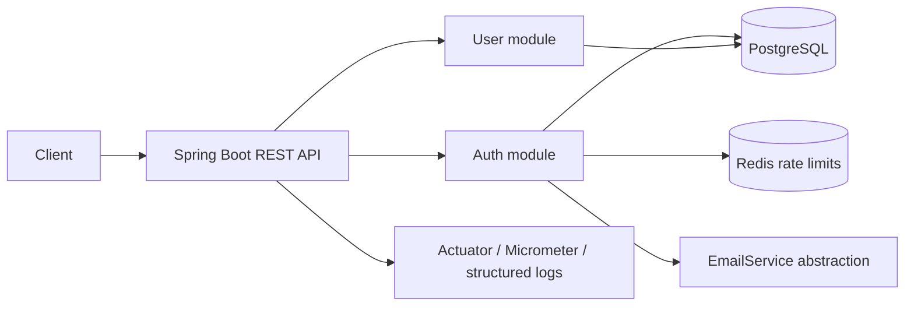

# Architecture

The kit is intentionally a **modular monolith**. Authentication, users, auditing, and cross-cutting security concerns have explicit package boundaries while remaining in one deployable Spring Boot service.

## Security decisions

Access tokens are short-lived JWTs. Refresh tokens are opaque random values; only SHA-256 hashes are persisted and rotation revokes the token that was presented. Passwords are BCrypt hashes. Password-reset and email-verification flows use single-use, expiring, hashed tokens and generic responses for account-existence privacy.

Sensitive authentication endpoints are rate-limited through Redis. If Redis is temporarily unavailable, the current reference implementation fails open and emits a warning so authentication does not become a single-point outage; production deployments may choose a fail-closed policy.

CSRF is disabled because the API is stateless and expects bearer tokens rather than browser cookies. Deploy behind HTTPS, restrict CORS to trusted origins, keep secrets in environment or secret-manager configuration, and do not log passwords, access tokens, refresh tokens, or reset tokens.
